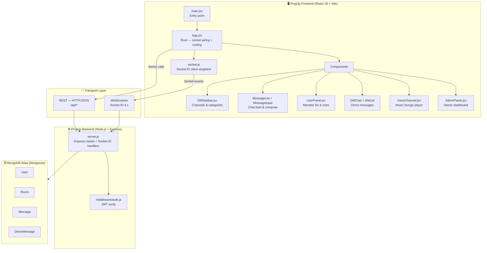

# PingUp — Architecture Overview

> A contributor-focused guide to how PingUp is structured and how its parts fit together.

---

## System Diagram

---

## Layer by Layer

### Frontend — `PingUp-Frontend/`
React 18 + Vite single-page app. All real-time state lives in `App.jsx`, which holds the socket connection and passes data down as props. `socket.js` exports a singleton Socket.IO client so every component shares one persistent connection. Styling is handled entirely by `index.css` — no utility-class framework.

### Transport
Two channels to the backend:

| Channel | Used for |
|---|---|
| REST (`/api/*`) | Auth, loading initial data on app start |
| Socket.IO | Everything real-time — messages, typing, presence, DMs, voice |

JWT tokens are attached to both — as a `Bearer` header for REST and as a handshake auth parameter for the socket.

### Backend — `PingUp-Backend/`
All server logic lives in `server.js`: Express routes and Socket.IO event handlers. `middleware/auth.js` handles JWT signing, verification, and socket-level auth. Permission checks (kick, ban, promote) are enforced here — never on the client.

### Database — MongoDB Atlas
| Model | Key fields |
|---|---|
| `User` | `role`, `banned`, `online`, `loginCount` |
| `Room` | `isPrivate`, `isReadOnly`, `isLocked`, `isVoice` |
| `Message` | `pinned`, `deleted`, `roomName` |
| `DirectMessage` | `conversationId`, `read`, `participants` |

---

## Key Files for New Contributors

| File | Why it matters |
|---|---|
| `src/App.jsx` | Start here — owns the socket, all top-level state, and routing |
| `src/socket.js` | Shared Socket.IO client — import this to emit or listen anywhere |
| `src/index.css` | Entire design system — CSS variables, layout, component styles |
| `server.js` | All REST routes and Socket.IO handlers |
| `middleware/auth.js` | JWT logic — touch this for anything auth-related |
| `models/` | Data shapes — check before writing any DB query |

---

## Message Lifecycle

1. User types in `MessageInput.jsx` and hits enter
2. `App.jsx` emits `message:send` via `socket.js`
3. `server.js` verifies JWT, saves to MongoDB
4. Server broadcasts `message:new` to the channel
5. `MessageList.jsx` appends it to state — no page refresh