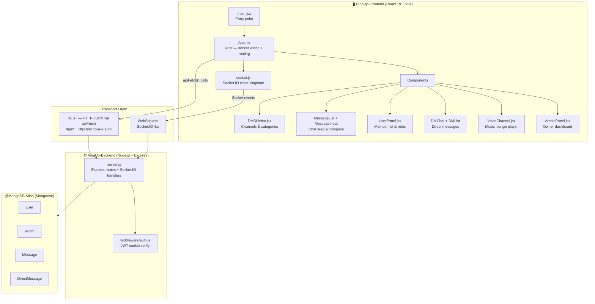

# PingUp — Architecture Overview

> A contributor-focused guide to how PingUp is structured and how its parts fit together.

---

## System Diagram

```mermaid
flowchart TD
    subgraph Client ["🖥️ PingUp-Frontend (React 19 + Vite)"]
        A[main.jsx\nEntry point] --> B[App.jsx\nRoot — socket wiring + routing]
        B --> C[socket.js\nSocket.IO client singleton]
        B --> D[Components]
        D --> D1[DMSidebar.jsx\nChannels & categories]
        D --> D2[MessageList + MessageInput\nChat feed & compose]
        D --> D3[UserPanel.jsx\nMember list & roles]
        D --> D4[DMChat + DMList\nDirect messages]
        D --> D5[VoiceChannel.jsx\nMusic lounge player]
        D --> D6[AdminPanel.jsx\nOwner dashboard]
    end

    subgraph Transport ["🔌 Transport Layer"]
        E[REST — HTTP/JSON via apiFetch\n/api/* · HttpOnly cookie auth]
        F[WebSockets\nSocket.IO 4.x]
    end

    subgraph Server ["⚙️ PingUp-Backend (Node.js + Express)"]
        G[server.js\nExpress routes + Socket.IO handlers]
        H[middleware/auth.js\nJWT cookie verify]
        G --> H
    end

    subgraph DB ["🗄️ MongoDB Atlas (Mongoose)"]
        I1[User]
        I2[Room]
        I3[Message]
        I4[DirectMessage]
    end

    C -- "Socket events" --> F
    B -- "apiFetch() calls" --> E
    E --> G
    F --> G
    G --> DB
```

---

## Layer by Layer

### Frontend — `PingUp-Frontend/`
React 19 + Vite single-page app. All real-time state lives in `App.jsx`, which holds the socket connection and passes data down as props. `socket.js` exports a singleton Socket.IO client so every component shares one persistent connection. Styling is handled entirely by `index.css` — no utility-class framework.

All REST calls go through the `apiFetch()` wrapper in `src/api.js`, which resolves the backend base URL and sends every request with `credentials: 'include'` so the session cookie is attached automatically.

### Transport
Two channels to the backend:

| Channel | Used for |
|---|---|
| REST (`/api/*`) | Auth, loading initial data on app start |
| Socket.IO | Everything real-time — messages, typing, presence, DMs, voice |

**Session auth — HttpOnly cookies.** On login/register the backend sets a `token` cookie (`httpOnly: true`, `secure` in production, `sameSite: none/lax`). The cookie is attached automatically by `apiFetch()` (`credentials: 'include'`) on REST calls and by the Socket.IO client (`withCredentials: true`); the socket also passes the in-memory token as a handshake `auth` parameter for the server's `socketAuthMiddleware`. No token is persisted in client-side storage (localStorage/sessionStorage) — tokens are held in memory only — which mitigates XSS-based session hijacking. On startup the app verifies the cookie by calling `GET /api/auth/me` (a `401` triggers logout).

### Backend — `PingUp-Backend/`
All server logic lives in `server.js`: Express routes and Socket.IO event handlers. `middleware/auth.js` handles JWT signing and verification: the REST `requireAuth` middleware reads the HttpOnly `token` cookie first (the `Bearer` header remains only as a fallback), and `socketAuthMiddleware` accepts the token from the handshake `auth` object or the cookie. Permission checks (kick, ban, promote) are enforced here — never on the client.

### Database — MongoDB Atlas
| Model | Key fields |
|---|---|
| `User` | `role`, `banned`, `online`, `loginCount` |
| `Room` | `isPrivate`, `isReadOnly`, `isLocked`, `isVoice` |
| `Message` | `pinned`, `deleted`, `roomName` |
| `DirectMessage` | `conversationId`, `read`, `participants` |

---

## Key Files for New Contributors

| File | Why it matters |
|---|---|
| `src/App.jsx` | Start here — owns the socket, all top-level state, and routing |
| `src/socket.js` | Shared Socket.IO client — import this to emit or listen anywhere |
| `src/index.css` | Entire design system — CSS variables, layout, component styles |
| `server.js` | All REST routes and Socket.IO handlers |
| `src/api.js` | `apiFetch()` wrapper — adds `credentials: 'include'` and the backend base URL to every REST call |
| `middleware/auth.js` | JWT + HttpOnly-cookie auth — touch this for anything auth-related |
| `models/` | Data shapes — check before writing any DB query |

---

## Message Lifecycle

1. User types in `MessageInput.jsx` and hits enter
2. `App.jsx` emits `message:send` via `socket.js`
3. `server.js` verifies the JWT from the session cookie, saves to MongoDB
4. Server broadcasts `message:new` to the channel
5. `MessageList.jsx` appends it to state — no page refresh